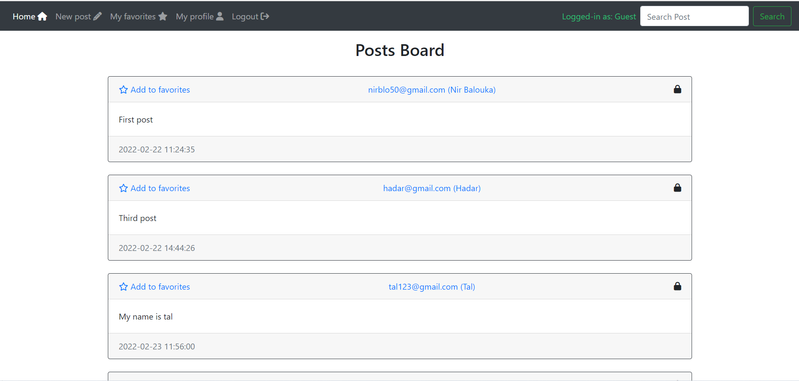
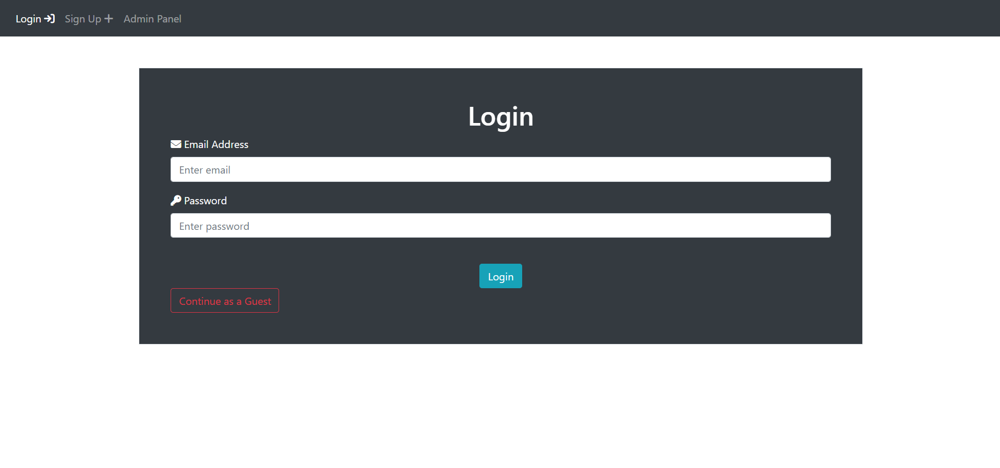

# Python Web-Project using Flask

<div style="display:flex; justify-content:center;">
    
    
</div>


##  About this project
```bash
Watch the demo at: http://nirblo50.pythonanywhere.com
This project is a Web-app that allows users to publish posts and view other user's posts. 
My main focus developing this project was the user management and sql database.
```
##  Features
```bash
1. User management: Sign-up / Login / Logout
2. User interface: Navbar / Buttons / Forms
3. Publishing posts and viewing other user's posts
4. Database (SQLAlchemy): Save users, prefferences and Posts
5. Email notifications and updates
```


### Setup & Installation

Make sure you have Python version of 3.9 or above installed.


```bash
pip install -r requirements.txt
```

### Running The App

```bash
python main.py
```

### Viewing The Website
```bash
To see the website I already deployed you can visit: http://nirblo50.pythonanywhere.com/

To deploy your own, after running main.py go to:
http://127.0.0.1:5000
```
